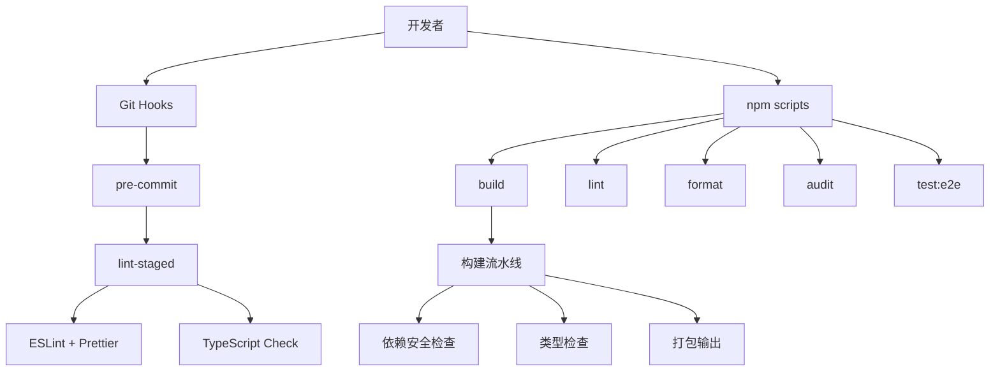

# 测试框架技术设计文档

更新时间: 2026-04-20

## 1. 描述

为 Weihui Medical 前端项目构建完整的测试框架，涵盖代码质量检查、类型检查、安全扫描和端到端测试。

## 2. 技术架构



## 3. 组件设计

### 3.1 ESLint 配置

**文件:** `.eslintrc.js`

```javascript
module.exports = {
  root: true,
  parser: '@typescript-eslint/parser',
  plugins: ['@typescript-eslint', 'react', 'react-hooks'],
  extends: [
    'eslint:recommended',
    'plugin:@typescript-eslint/recommended',
    'plugin:react/recommended',
    'plugin:react-hooks/recommended',
  ],
  settings: {
    react: { version: 'detect' },
  },
  rules: {
    'react/react-in-jsx-scope': 'off',
    '@typescript-eslint/explicit-module-boundary-types': 'off',
  },
};
```

### 3.2 Prettier 配置

**文件:** `.prettierrc.js`

```javascript
module.exports = {
  semi: true,
  singleQuote: true,
  tabWidth: 2,
  trailingComma: 'es5',
  printWidth: 100,
  arrowParens: 'avoid',
};
```

### 3.3 Playwright 配置

**文件:** `playwright.config.ts`

```typescript
import { defineConfig, devices } from '@playwright/test';

export default defineConfig({
  testDir: './tests/e2e',
  fullyParallel: true,
  forbidOnly: !!process.env.CI,
  retries: process.env.CI ? 2 : 0,
  workers: process.env.CI ? 1 : undefined,
  reporter: [['html', { outputFolder: 'playwright-report' }]],
  use: {
    baseURL: 'http://localhost:3266',
    trace: 'on-first-retry',
  },
  projects: [{ name: 'chromium', use: { ...devices['Desktop Chrome'] } }],
  webServer: {
    command: 'npm run dev',
    url: 'http://localhost:3266',
    reuseExistingServer: !process.env.CI,
  },
});
```

### 3.4 测试文件结构

```
tests/
├── e2e/
│   ├── navigation.spec.ts    # 路由导航测试
│   ├── homepage.spec.ts     # 首页 UI 测试
│   └── basic.spec.ts         # 基础功能测试
└── setup/
    └── global-setup.ts      # Playwright 全局配置
```

## 4. 数据模型

### 4.1 package.json 脚本

```json
{
  "scripts": {
    "dev": "webpack serve",
    "build": "webpack --mode production",
    "typecheck": "tsc --noEmit",
    "lint": "eslint src --ext .ts,.tsx --fix",
    "format": "prettier --write \"src/**/*.{ts,tsx,css}\"",
    "audit": "npm audit --audit-level=high",
    "test:e2e": "playwright test",
    "test:e2e:ui": "playwright test --ui",
    "test": "npm run typecheck && npm run lint && npm run audit && npm run test:e2e",
    "prepare": "husky install"
  }
}
```

## 5. 正确性属性

| 属性       | 描述                            |
| ---------- | ------------------------------- |
| 构建成功   | `npm run build` 返回退出码 0    |
| 类型安全   | TypeScript 编译无错误           |
| 代码规范   | ESLint 检查无 error 级别违规    |
| 无高危漏洞 | npm audit 无 Critical/High 漏洞 |
| 路由正确   | 所有路由页面可访问              |
| UI 正常    | 页面无控制台错误                |

## 6. 错误处理

| 场景                | 处理方式                 |
| ------------------- | ------------------------ |
| ESLint 错误         | 输出错误位置，终止构建   |
| TypeScript 错误     | 输出类型错误，终止构建   |
| 高危漏洞            | 输出漏洞报告，终止构建   |
| Playwright 测试失败 | 生成截图和报告，终止测试 |
| 浏览器未安装        | 自动提示安装命令         |

## 7. 测试策略

### 7.1 持续集成流程

```bash
# pre-commit hook (lint-staged)
npm run typecheck && npm run lint

# CI/CD pipeline
npm run build  # 包含 typecheck + audit
npm run test:e2e
```

### 7.2 测试覆盖范围

- **路由测试**: `/`, `/products`, `/solutions`, `/about`
- **交互测试**: 导航菜单点击，链接跳转
- **UI 测试**: 页面加载无错误，元素可见

## 8. 依赖清单

| 包名                             | 版本    | 用途                   |
| -------------------------------- | ------- | ---------------------- |
| eslint                           | ^8.0.0  | 代码检查               |
| @typescript-eslint/eslint-plugin | ^6.0.0  | TypeScript ESLint      |
| @typescript-eslint/parser        | ^6.0.0  | TypeScript 解析器      |
| prettier                         | ^3.0.0  | 代码格式化             |
| eslint-config-prettier           | ^9.0.0  | ESLint + Prettier 兼容 |
| @playwright/test                 | ^1.40.0 | E2E 测试               |
| husky                            | ^9.0.0  | Git hooks              |
| lint-staged                      | ^15.0.0 | staged 文件检查        |

## 9. 参考

- [ESLint 文档](https://eslint.org/)
- [Prettier 文档](https://prettier.io/)
- [Playwright 文档](https://playwright.dev/)
- [Husky 文档](https://typicode.github.io/husky/)
